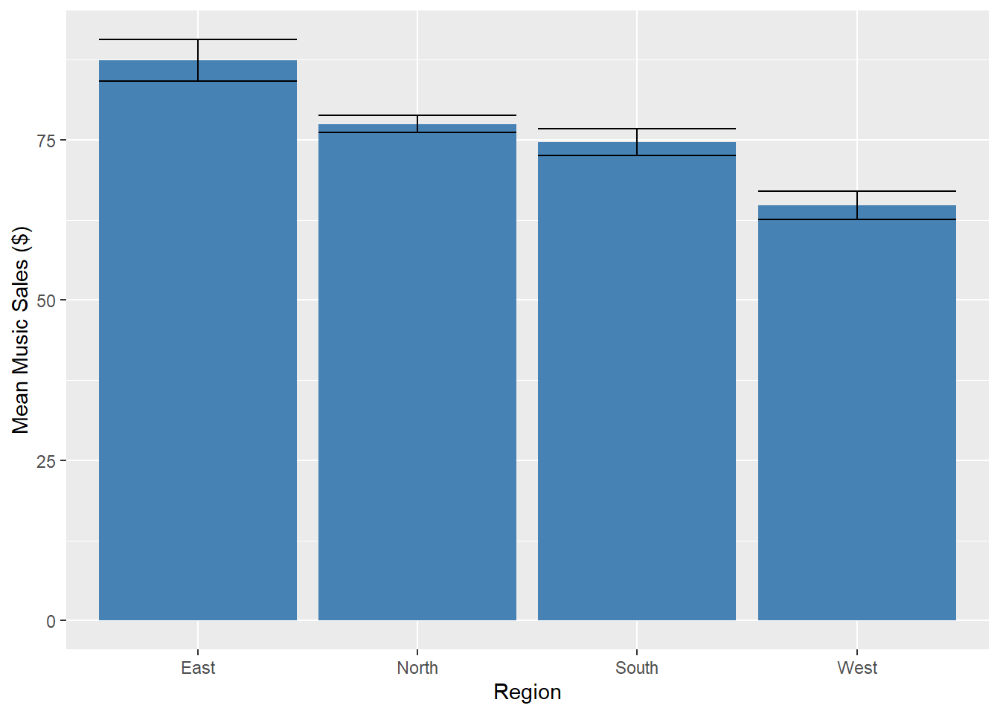
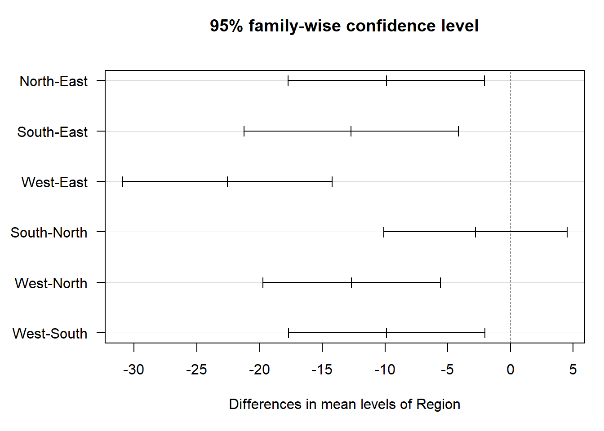

## INFS 2049 Experimental Design

### Joshua Chopin

### 2025-01-10

**(Student: Michael Hudson)**

<hr/>

This week we are going to be looking at completely randomised designs which will be analyzed using ANOVA tests and ad-hoc procedures. The dataset to be used this week relates to sales of books, music and electronics in four major regions; North, South, East and West. The sales data comes in the form of a .csv file. Remember you will need the `readr` package installed to load it using the `read_csv` function. And as always, we should begin by summarising the data.


::: {.cell}

```{.r .cell-code}
library(tidyverse)
```

::: {.cell-output .cell-output-stderr}

```
Warning: package 'lubridate' was built under R version 4.4.2
```


:::

::: {.cell-output .cell-output-stderr}

```
── Attaching core tidyverse packages ──────────────────────── tidyverse 2.0.0 ──
✔ dplyr     1.1.4     ✔ readr     2.1.5
✔ forcats   1.0.0     ✔ stringr   1.5.1
✔ ggplot2   3.5.1     ✔ tibble    3.2.1
✔ lubridate 1.9.4     ✔ tidyr     1.3.1
✔ purrr     1.0.2     
── Conflicts ────────────────────────────────────────── tidyverse_conflicts() ──
✖ dplyr::filter() masks stats::filter()
✖ dplyr::lag()    masks stats::lag()
ℹ Use the conflicted package (<http://conflicted.r-lib.org/>) to force all conflicts to become errors
```


:::
:::

::: {.cell}

```{.r .cell-code}
salesdata <- read_csv("sales.csv")
```

::: {.cell-output .cell-output-stderr}

```
Rows: 200 Columns: 8
── Column specification ────────────────────────────────────────────────────────
Delimiter: ","
chr (2): Region, Gender
dbl (6): Transaction, Advertising, Book_Sales, Music_Sales, Electronics_Sale...

ℹ Use `spec()` to retrieve the full column specification for this data.
ℹ Specify the column types or set `show_col_types = FALSE` to quiet this message.
```


:::

```{.r .cell-code}
head(salesdata)
```

::: {.cell-output .cell-output-stdout}

```
# A tibble: 6 × 8
  Transaction Region Advertising Gender Book_Sales Music_Sales Electronics_Sales
        <dbl> <chr>        <dbl> <chr>       <dbl>       <dbl>             <dbl>
1           1 West             1 Male          260          85               410
2           2 West             0 Male          320          85               450
3           3 West             1 Female        280          65               540
4           4 South            1 Female        300          60               250
5           5 West             1 Female        270          80               450
6           6 West             0 Female        290          55               410
# ℹ 1 more variable: Total_Sales <dbl>
```


:::
:::

::: {.cell}

```{.r .cell-code}
summary(salesdata)
```

::: {.cell-output .cell-output-stdout}

```
  Transaction        Region           Advertising      Gender         
 Min.   :  1.00   Length:200         Min.   :0.00   Length:200        
 1st Qu.: 50.75   Class :character   1st Qu.:0.00   Class :character  
 Median :100.50   Mode  :character   Median :1.00   Mode  :character  
 Mean   :100.50                      Mean   :0.62                     
 3rd Qu.:150.25                      3rd Qu.:1.00                     
 Max.   :200.00                      Max.   :1.00                     
   Book_Sales     Music_Sales     Electronics_Sales  Total_Sales    
 Min.   :130.0   Min.   : 25.00   Min.   :220.0     Min.   : 440.0  
 1st Qu.:250.0   1st Qu.: 65.00   1st Qu.:330.0     1st Qu.: 668.8  
 Median :280.0   Median : 75.00   Median :380.0     Median : 742.5  
 Mean   :277.3   Mean   : 75.45   Mean   :388.6     Mean   : 741.3  
 3rd Qu.:310.0   3rd Qu.: 85.00   3rd Qu.:450.0     3rd Qu.: 801.2  
 Max.   :450.0   Max.   :125.00   Max.   :610.0     Max.   :1085.0  
```


:::
:::


You can see that along with the sales and region data for each transaction we have information about the gender of the customer as well as a variable related to advertising. There are a number of hypotheses we could test using this data, but today we are going to test whether there is a statistically significant difference in average music sales by region. There are four different regions in the dataset (North, South, East and West), so the formulation of the hypothesis test looks like this:

Null Hypothesis ($H_0$): All means are equal i.e.

$H_0: \mu_N = \mu_E = \mu_S = \mu_W$

Alternative Hypothesis ($H_1$): Not all means are equal.

**Q.** Write down some other hypotheses that could be formulated for a one-way ANOVA test using this data.

Previously, we have defaulted to boxplots to get a first look at the data, you are more than welcome to create one on your own, actually -

**Q.** Create a boxplot with region on the x-axis and music sales on the y-axis.

but in this practical we will try a barplot with error bars. Recall from Practical 1 that we can use the aggregate function to get mean values within groups. Here we can modify the aggregate function to get both the mean and standard errors for each region. Note that we calculate standard error using the variance for each region divided by the sample size.


::: {.cell}

```{.r .cell-code}
mean_and_se <- aggregate(Music_Sales ~ Region,
                         salesdata,
                         function(x) c(mean = mean(x), se = sqrt(var(x)/length(x))))
mean_and_se$Music_Sales[, 1]
```

::: {.cell-output .cell-output-stdout}

```
[1] 87.36111 77.46377 74.66667 64.80000
```


:::
:::

::: {.cell}

```{.r .cell-code}
mean_and_se$Music_Sales[, 2]
```

::: {.cell-output .cell-output-stdout}

```
[1] 3.264079 1.344462 2.098581 2.199072
```


:::
:::

::: {.cell}

```{.r .cell-code}
ggplot(data = mean_and_se,
       aes(x = Region, y = Music_Sales[, 1])) +
  geom_bar(stat = "identity", fill = "steelblue") +
  geom_errorbar(aes(ymin = Music_Sales[, 1] - Music_Sales[, 2],
                    ymax = Music_Sales[, 1] + Music_Sales[, 2])) +
  ylab("Mean Music Sales ($)")
```

::: {.cell-output-display}
{width=672}
:::
:::


**Q.** Using the barplot, does it appear there are differences in mean sales between some of the regions? If so, which ones? Which differences would you expect to be statistically significant?

Before conducting the hypothesis test we need to check all the necessary requirements. The first of which is whether all the samples are normally distributed. To do so we will use the Shapiro-Wilk test introduced last week.


::: {.cell}

```{.r .cell-code}
shapiro.test(salesdata$Music_Sales[salesdata$Region == "West"])
```

::: {.cell-output .cell-output-stdout}

```

	Shapiro-Wilk normality test

data:  salesdata$Music_Sales[salesdata$Region == "West"]
W = 0.9821, p-value = 0.6431
```


:::
:::

::: {.cell}

```{.r .cell-code}
shapiro.test(salesdata$Music_Sales[salesdata$Region == "East"])
```

::: {.cell-output .cell-output-stdout}

```

	Shapiro-Wilk normality test

data:  salesdata$Music_Sales[salesdata$Region == "East"]
W = 0.96418, p-value = 0.2883
```


:::
:::

::: {.cell}

```{.r .cell-code}
shapiro.test(salesdata$Music_Sales[salesdata$Region == "South"])
```

::: {.cell-output .cell-output-stdout}

```

	Shapiro-Wilk normality test

data:  salesdata$Music_Sales[salesdata$Region == "South"]
W = 0.97257, p-value = 0.3577
```


:::
:::

::: {.cell}

```{.r .cell-code}
shapiro.test(salesdata$Music_Sales[salesdata$Region == "North"])
```

::: {.cell-output .cell-output-stdout}

```

	Shapiro-Wilk normality test

data:  salesdata$Music_Sales[salesdata$Region == "North"]
W = 0.95878, p-value = 0.02288
```


:::
:::


We can see that for the West, East and South regions, the *p* value is greater than 0.05 so normality can be assumed. The North region has a *p* value of approximately 0.02, however the sample size is reasonably large (>30) and the distribution is not severly skewed so we can proceed.

**Q.** The boxplots created earlier give us some indication of whether the data from the North region is skewed. Try creating a histogram to further support this claim.

The next requirement to check is whether variances among the samples are equal.


::: {.cell}

```{.r .cell-code}
region_sd <- aggregate(salesdata$Music_Sales, list(salesdata$Region), sd)
region_sd
```

::: {.cell-output .cell-output-stdout}

```
  Group.1        x
1    East 19.58447
2   North 11.16794
3   South 14.07771
4    West 15.54979
```


:::
:::


$$
\frac{\sigma_{largest}}{\sigma_{smallest}}=\frac{19.58447}{11.16794}=1.753<2
$$

It looks like the variances of the samples may be equal, as the result is less than two, but it is close. To investigate further, we can use some of R's in-built functions to test for equality of variance, such as Bartlett's or Levene's test.


::: {.cell}

```{.r .cell-code}
bartlett.test(Music_Sales ~ Region, data = salesdata)
```

::: {.cell-output .cell-output-stdout}

```

	Bartlett test of homogeneity of variances

data:  Music_Sales by Region
Bartlett's K-squared = 15.999, df = 3, p-value = 0.001135
```


:::
:::


Here the p-value is well under the target value of 0.05, suggesting that there may be evidence to suggest that the variance across regions is statistically significantly different. Lets try Levene's test, it requires the `car` package.


::: {.cell}

```{.r .cell-code}
library(car)
```

::: {.cell-output .cell-output-stderr}

```
Warning: package 'car' was built under R version 4.4.2
```


:::

::: {.cell-output .cell-output-stderr}

```
Loading required package: carData
```


:::

::: {.cell-output .cell-output-stderr}

```
Warning: package 'carData' was built under R version 4.4.2
```


:::

::: {.cell-output .cell-output-stderr}

```

Attaching package: 'car'
```


:::

::: {.cell-output .cell-output-stderr}

```
The following object is masked from 'package:dplyr':

    recode
```


:::

::: {.cell-output .cell-output-stderr}

```
The following object is masked from 'package:purrr':

    some
```


:::
:::

::: {.cell}

```{.r .cell-code}
leveneTest(Music_Sales ~ Region, data = salesdata)
```

::: {.cell-output .cell-output-stderr}

```
Warning in leveneTest.default(y = y, group = group, ...): group coerced to
factor.
```


:::

::: {.cell-output .cell-output-stdout}

```
Levene's Test for Homogeneity of Variance (center = median)
       Df F value  Pr(>F)  
group   3  3.2488 0.02295 *
      196                  
---
Signif. codes:  0 '***' 0.001 '**' 0.01 '*' 0.05 '.' 0.1 ' ' 1
```


:::
:::


Once again the result is below the 0.05 threshold, so it appears that the assumption of homogeneity of variance has been violated. As a result, we report Welch's corrected F-ratio instead of the one given in a standard ANOVA table. In R we call the Welch ANOVA using `oneway.test`. It is worth noting that `oneway.test` has an argument called *var.equal*, which takes a value of TRUE or FALSE, depending on whether the variances in the samples should be treated as equal or not, but this defaults to FALSE so we don't need to specify.


::: {.cell}

```{.r .cell-code}
w_anova <- oneway.test(Music_Sales ~ Region, data = salesdata)
w_anova
```

::: {.cell-output .cell-output-stdout}

```

	One-way analysis of means (not assuming equal variances)

data:  Music_Sales and Region
F = 12.856, num df = 3.000, denom df = 91.143, p-value = 4.451e-07
```


:::
:::


The p-value is much smaller than our significance level of 0.05, so we can reject the null hypothesis and conclude that there are differences among the mean values of music sales across regions. For interests sake we can also run a standard ANOVA.


::: {.cell}

```{.r .cell-code}
s_anova <- aov(Music_Sales ~ Region, data = salesdata)
summary(s_anova)
```

::: {.cell-output .cell-output-stdout}

```
             Df Sum Sq Mean Sq F value   Pr(>F)    
Region        3  11086    3695   17.05 7.01e-10 ***
Residuals   196  42473     217                     
---
Signif. codes:  0 '***' 0.001 '**' 0.01 '*' 0.05 '.' 0.1 ' ' 1
```


:::
:::


and see that in this case the conclusion would have been the same.

Next, we can look at the parameter estimates (differences in mean) relative to the mean for the East region.


::: {.cell}

```{.r .cell-code}
summary(lm(Music_Sales ~ Region, data = salesdata))
```

::: {.cell-output .cell-output-stdout}

```

Call:
lm(formula = Music_Sales ~ Region, data = salesdata)

Residuals:
    Min      1Q  Median      3Q     Max 
-39.800  -9.667   0.200  10.333  37.639 

Coefficients:
            Estimate Std. Error t value Pr(>|t|)    
(Intercept)   87.361      2.453  35.607  < 2e-16 ***
RegionNorth   -9.897      3.027  -3.270 0.001270 ** 
RegionSouth  -12.694      3.292  -3.857 0.000156 ***
RegionWest   -22.561      3.218  -7.012 3.72e-11 ***
---
Signif. codes:  0 '***' 0.001 '**' 0.01 '*' 0.05 '.' 0.1 ' ' 1

Residual standard error: 14.72 on 196 degrees of freedom
Multiple R-squared:  0.207,	Adjusted R-squared:  0.1948 
F-statistic: 17.05 on 3 and 196 DF,  p-value: 7.005e-10
```


:::
:::


One of the first things to note from the summary table is that all mean differences are statistically significant. However, the summary table also gives us some indication of the ways that they differ.

**Q.** The estimate for (Intercept) represents the mean value in the East region. What do the estimates for the other regions represent? Why are they all negative?

In order to get a better idea of these mean differences we can conduct an ad-hoc test. There are a number of different post-hoc tests that can be conducted following a hypothesis test. One of the most popular options, that we will now use, is Tukey's test, also known as the Tukey method, also known as Tukey's HSD (Honestly Significant Difference). Tukey's test should be carried out on the results of standard ANOVA rather than the Welch's ANOVA that we used previously. We will run Tukey's on the Standard ANOVA we created, then run a different pairwise test for the Welch's ANOVA.


::: {.cell}

```{.r .cell-code}
tukey_test <- TukeyHSD(s_anova)
tukey_test
```

::: {.cell-output .cell-output-stdout}

```
  Tukey multiple comparisons of means
    95% family-wise confidence level

Fit: aov(formula = Music_Sales ~ Region, data = salesdata)

$Region
                  diff       lwr        upr     p adj
North-East   -9.897343 -17.73979  -2.054891 0.0069049
South-East  -12.694444 -21.22384  -4.165054 0.0008914
West-East   -22.561111 -30.89881 -14.223417 0.0000000
South-North  -2.797101 -10.10605   4.511842 0.7543673
West-North  -12.663768 -19.74807  -5.579468 0.0000388
West-South   -9.866667 -17.70464  -2.028698 0.0070919
```


:::
:::


There are a lot of numbers in the output, but a few things stand out. The adjusted p-value is significant at the 0.05 level for all mean differences except for North and South. Furthermore, the largest difference by far appears to be between the East and West regions. We can visualise these results using base R's `plot` command. By default if we don't give R any information about how the data should be plotted, it will do its best to choose the right format based on the data. You can see below that we can simply pass *tukey.test* to the plot command to get a nice visualisation of the confidence intervals (I had to change a couple of settings to rotate axis labels and keep them on the page).


::: {.cell}

```{.r .cell-code}
par(mar = c(5, 6, 4, 1) + 0.1)
plot(tukey_test, las = 1)
```

::: {.cell-output-display}
{width=672}
:::
:::


As the numbers indicated, the difference in mean between the South and North region might not be significant. Also keep in mind when interpreting these values that sign is important. West - North has a value of -12.66, so the negative sign tells us that North had the greater mean music sales.

The ad-hoc test we use following Welch's ANOVA is called Games-Howell, and we will need to access it through a new package.


::: {.cell}

```{.r .cell-code}
# install.packages("rstatix")
library(rstatix)
```

::: {.cell-output .cell-output-stderr}

```
Warning: package 'rstatix' was built under R version 4.4.2
```


:::

::: {.cell-output .cell-output-stderr}

```

Attaching package: 'rstatix'
```


:::

::: {.cell-output .cell-output-stderr}

```
The following object is masked from 'package:stats':

    filter
```


:::
:::


The `rstatix` package has a function called `games_howell_test` which we will call by passing first the dataframe, then the formula for our factors and, if necessary, a confidence level, though we will stick with the default 0.95.


::: {.cell}

```{.r .cell-code}
games_howell_test(salesdata, Music_Sales ~ Region)
```

::: {.cell-output .cell-output-stdout}

```
# A tibble: 6 × 8
  .y.         group1 group2 estimate conf.low conf.high      p.adj p.adj.signif
* <chr>       <chr>  <chr>     <dbl>    <dbl>     <dbl>      <dbl> <chr>       
1 Music_Sales East   North     -9.90   -19.3     -0.497 0.036      *           
2 Music_Sales East   South    -12.7    -22.9     -2.45  0.009      **          
3 Music_Sales East   West     -22.6    -32.9    -12.2   0.00000168 ****        
4 Music_Sales North  South     -2.80    -9.34     3.74  0.677      ns          
5 Music_Sales North  West     -12.7    -19.4     -5.91  0.0000256  ****        
6 Music_Sales South  West      -9.87   -17.8     -1.91  0.009      **          
```


:::
:::


We can see that for the most part the results between the two tests are similar. The estimate for mean differences is actually identical, but they differ in confidence intervals and adjusted p-values. The overall results don't change, that is, all of the mean differences are significant except for North and South.

**Q.** Do these results confirm your impressions from the error bar plot?

Finally, lets try some different contrasts. Until now we have been testing the hypothesis that not all means are equal, and the post-hoc tests have given us more clarity around the answer to that question. But let us say the hypothesis itself changes, such as; is the mean for the North region different to the mean for the South region? i.e. $H_0: \mu_S = \mu_N$ or is the mean of the East and North regions together different from the mean of the South and West regions? i.e. $H_0: \frac{1}{2}(\mu_E + \mu_N) = \frac{1}{2}(\mu_S + \mu_W)$. There is an easy way to test these hypotheses using our existing ANOVA model and the `gmodels` package.


::: {.cell}

```{.r .cell-code}
# install.packages("gmodels")
library(gmodels)
```

::: {.cell-output .cell-output-stderr}

```
Warning: package 'gmodels' was built under R version 4.4.2
```


:::
:::


First we need to convert the Region variable to a factor, then take a look at Region to find the order of the levels.


::: {.cell}

```{.r .cell-code}
salesdata$Region <- factor(salesdata$Region)
levels(salesdata$Region)
```

::: {.cell-output .cell-output-stdout}

```
[1] "East"  "North" "South" "West" 
```


:::
:::


Once we know which order the levels are in we can define some contrasts. The below lines of code may not look straight forward but see if you can piece it all together once we print the variable `L` to the screen.


::: {.cell}

```{.r .cell-code}
con <- matrix(c(0, -1, 1, 0, -1, -1, 1, 1), 4, 2)
L <- t(con)
rownames(L) <- c(" - North v South", " - E&N v S&W")
L
```

::: {.cell-output .cell-output-stdout}

```
                 [,1] [,2] [,3] [,4]
 - North v South    0   -1    1    0
 - E&N v S&W       -1   -1    1    1
```


:::
:::


Let us explain what happened here. The matrix that we initialised called `con` houses the contrasts. As we have four levels in our Region factor, the first four entries of `con` are the first contrast. Using the order of levels we saw earlier this is a value of 0 for East, -1 for North, 1 for South and 0 for West, indicating that North is the baseline, South is being tested and East and West aren't being used. The next contrast refers to the second hypothesis that we formulated earlier. Finally, the 4, 2 part, shapes the matrix to have 4 columns and 2 rows. We transpose the matrix using the `t` function, then provide some rownames for the two hypotheses. From the `gmodels` package we call the `fit.contrasts` function, providing it with the ANOVA we made earlier, the factor that we are interested in and our matrix of contrasts.


::: {.cell}

```{.r .cell-code}
fit.contrast(s_anova, "Region", L)
```

::: {.cell-output .cell-output-stdout}

```
                         Estimate Std. Error   t value     Pr(>|t|)
Region - North v South  -2.797101   2.820671 -0.991644 3.225939e-01
Region - E&N v S&W     -25.358213   4.278983 -5.926224 1.373740e-08
```


:::
:::


Based on the output we can see that mean sales in the South are slightly less than in the North, but the difference is not statistically significant at the 0.05 significance level. Alternatively, the mean difference in sales between the two pairs of regions is over $25 and was found to be statistically significant.

**Power calculations for ANOVA**

In the last practical we used `pwr.t.test` to calculate the power of our t-test. There is a function, called `Fpower1` from the package `daewr` that can be used to calculate the power of our ANOVA test. It takes as input: the minimum and maximum number of replicates considered, the significance level alpha, the standard error of the experimental error sigma, the number of levels in the factor and delta, the difference required between means. Below we calculate a vector of power values when trying to detect a difference in music sale means as large as $20, for the case of 2 to 5 replicates. The value of Sigma = 14.72 comes from our earlier model's output under 'Residual Standard Error'.


::: {.cell}

```{.r .cell-code}
# install.packages("daewr")
library(daewr)
```

::: {.cell-output .cell-output-stderr}

```
Warning: package 'daewr' was built under R version 4.4.2
```


:::
:::

::: {.cell}

```{.r .cell-code}
my_rmin <- 2
my_rmax <- 5
my_alpha <- rep(0.05, my_rmax - my_rmin + 1)
my_sigma <- 14.72
my_nlev <- 4
my_nreps <- my_rmin:my_rmax
my_Delta <- 20
my_power <- Fpower1(alpha = my_alpha, nlev = my_nlev, nreps = my_nreps, Delta = my_Delta, sigma = my_sigma)
my_power
```

::: {.cell-output .cell-output-stdout}

```
     alpha nlev nreps Delta sigma     power
[1,]  0.05    4     2    20 14.72 0.1027599
[2,]  0.05    4     3    20 14.72 0.1734597
[3,]  0.05    4     4    20 14.72 0.2499217
[4,]  0.05    4     5    20 14.72 0.3283033
```


:::
:::


We can see that even with 5 replicates there is more than a 65% chance the difference will be missed.

**Q.** Calculate how many replicates are required to reach 80% power.

**Q.** Suppose we wanted to detect a difference of 2 times the standard error, how many replicates are required to reach 80% power now? Did the number of replicates go up or down? Why?

**Q.** Suppose for the previous question the number of levels was 8 instead of 4, how many replicates are required to reach 80% power now? Did the number of replicates go up or down? Why?

**Have a go on your own**

There is another .csv file provided with this practical, called *diet.csv*. The data in this file contains information on 78 people using one of three diets. The data includes each person's gender (1 = male, 0 = female), age, height and pre and post-diet weights.

**Q.** Load the data into R and view its summary statistics.

**Q.** If we ignore diet, there is a simple paired t-test that could be considered, what is it? Formulate the hpothesis.

**Q.** Suppose we want to determine which diet was best for losing weight. Perform the necessary checks of the requirements for conducting an ANOVA test, then decide which test should be used. Follow up with whichever ad-hoc procedure is appropriate and conclude on your findings.

**Q.** Calculate the number of replicates required for your test to reach 80% power.

**Q.** Try testing some different contrasts for the diets. Can you devise some contrasts to test whether the mean of Diets 2 and 3 is equal to the mean of Diet 1?

My Notes

